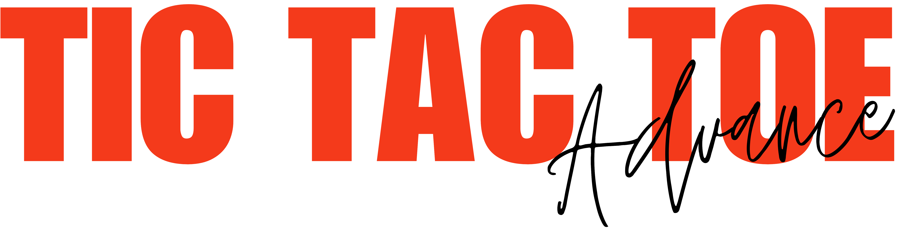

# XOXO

This is an advanced version of the classic Tic-Tac-Toe game, built with HTML, CSS, and JavaScript. It introduces a dynamic and strategic twist where players are limited to three moves at a time, adding more depth to the gameplay. A single-player mode is also available, where the user can play against an AI opponent.

You can play the live demo [here](https://tariqulislamrahat.github.io/xoxo).

## Key Concepts

### Basic Game Rules

- **Grid:** The game is played on a 3x3 grid.
- **Players:** There are two players: "X" and "O". Player "X" always starts.
- **Gameplay:** Players take turns to click on any empty cell in the grid to place their respective mark (X or O).
- **Objective:** The goal is to get three of the same symbol (X or O) in a row—horizontally, vertically, or diagonally.
- **Winning:** The first player to complete a row, column, or diagonal with their symbol wins the game.

### Maximum Moves Per Player

In this version, each player can place **up to 3 marks** at a time. After placing their third mark, the game automatically removes their **oldest move** (the first mark they made). This mechanic forces players to think strategically about their moves.

### Removing the Oldest Move

- **How It Works:** When a player places their third mark, the game will "remove" their oldest move. 
- **Visual Effect:** The oldest mark will fade out and be replaced by an empty cell after a brief animation.
- **Strategic Impact:** This adds a layer of strategy, as players cannot just keep placing marks without considering the placement of their existing marks. It encourages careful planning to avoid being stuck with an unhelpful move.

### Winning the Game

The game checks if any player has achieved the classic Tic-Tac-Toe win condition: three marks in a row (either horizontally, vertically, or diagonally). 
- **If a winner is detected**, the game will display a message indicating who won.

### Restarting the Game

After a game ends, you can click the **"Restart"** button to reset the game and start with a fresh board.

## How the "Removing Moves" Feature Works

- **Tracking Moves:** The moves of each player are tracked in separate arrays (`xMoves` and `oMoves`), which store the indices of the cells where the marks are placed.
- **Max Moves Per Player:** Once a player reaches 3 marks, the game:
  - **Stores the Moves:** The moves are saved in the player’s move array (`xMoves` or `oMoves`).
  - **Removes the Oldest Move:** The oldest move (the first move made) is removed from the board. After a short animation, the symbol in the cell fades out, and the cell is cleared.
  
This mechanic forces players to make thoughtful decisions, as they must plan for the removal of their oldest move once they reach the limit of 3.

## Features

- **Dynamic Gameplay:** Limit the number of moves a player can make, forcing them to think strategically.
- **Move Removal:** Players can’t stack moves indefinitely and must manage their position carefully.
- **Win Detection:** The game will detect when a player has achieved the classic Tic-Tac-Toe win condition.
- **Restart Functionality:** Reset the game and start fresh with a new grid.
- **Single Player Mode:** Play against an AI opponent with a simple yet effective algorithm for decision-making.

## Single Player Mode: AI Algorithm

In Single Player mode, the player competes against an AI (Computer) opponent. The AI uses a basic decision-making algorithm to choose its moves, providing an enjoyable challenge for the player. 

### Algorithm Overview

The AI's move selection is based on the **Minimax Algorithm**, which is commonly used in game theory to choose the optimal move for a player. Here's a breakdown of how the algorithm works:

#### 1. **Minimax Algorithm:**
The AI looks ahead at the possible future game states and chooses the best one based on two principles:
- **Maximizing its score (AI's perspective):** The AI tries to maximize its chance of winning.
- **Minimizing the player’s score (Player's perspective):** It also tries to minimize the player’s chance of winning.

The AI explores all possible moves and evaluates each resulting game state based on the following conditions:
- **Winning Move:** If the AI can win immediately, it will choose that move.
- **Blocking Move:** If the AI cannot win, it will check if the player has a winning move and block it.
- **Optimal Move:** If neither player can win, the AI will choose a move that brings it closer to winning in the future or takes a strategic position (such as the center or corners).

#### 2. **Game Tree Search:**
The AI simulates the entire game tree (all possible board configurations) up to a certain depth. The depth is determined by how many turns ahead the AI looks. The AI evaluates the board at each level using a simple scoring system:
- **+1** for a win.
- **0** for a tie.
- **-1** for a loss.

#### 3. **Move Evaluation:**
The AI picks the move with the highest score (i.e., the move that maximizes its chances of winning or minimizes the player’s chances). The evaluation process is recursive, and the algorithm backtracks to find the optimal move.

#### 4. **AI Decision Process:**
- **Step 1:** The AI analyzes all possible moves.
- **Step 2:** It checks if any of those moves will result in an immediate win.
- **Step 3:** If no immediate win is possible, it blocks any winning moves from the player.
- **Step 4:** If no blocking is needed, it evaluates moves based on strategic positioning.
- **Step 5:** Once the AI selects its best move, it places its mark on the board.

## Credits

- Original game concept and design by [Tariqul Islam](https://facebook.com/thetariqulislam).

## Version 2.0

- Fixed some bugs and issues.
- Added more bugs to fix later.

## License

This project is licensed under the Apache License 2.0 - see the [LICENSE](./LICENSE) file for details.
