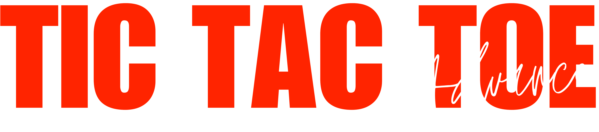

# XOXO

This is an advanced version of the classic Tic-Tac-Toe game, built with HTML, CSS, and JavaScript. It introduces a dynamic and strategic twist where players are limited to three moves at a time, adding more depth to the gameplay. A single-player mode is also available, where the user can play against an AI opponent.

You can play the live demo [here](https://tariqulislamrahat.github.io/xoxo).

## Key Concepts

### Basic Game Rules

- **Grid:** The game is played on a 3x3 grid.
- **Players:** There are two players: "X" and "O". Player "X" always starts.
- **Gameplay:** Players take turns to click on any empty cell in the grid to place their respective mark (X or O).
- **Objective:** The goal is to get three of the same symbol (X or O) in a row—horizontally, vertically, or diagonally.
- **Winning:** The first player to complete a row, column, or diagonal with their symbol wins the game.

### Maximum Moves Per Player

In this version, each player can place **up to 3 marks** at a time. After placing their third mark, the game automatically removes their **oldest move** (the first mark they made). This mechanic forces players to think strategically about their moves.

### Removing the Oldest Move

- **How It Works:** When a player places their third mark, the game will "remove" their oldest move. 
- **Visual Effect:** The oldest mark will fade out and be replaced by an empty cell after a brief animation.
- **Strategic Impact:** This adds a layer of strategy, as players cannot just keep placing marks without considering the placement of their existing marks. It encourages careful planning to avoid being stuck with an unhelpful move.

### Winning the Game

The game checks if any player has achieved the classic Tic-Tac-Toe win condition: three marks in a row (either horizontally, vertically, or diagonally). 
- **If a winner is detected**, the game will display a message indicating who won.

### Restarting the Game

After a game ends, you can click the **"Restart"** button to reset the game and start with a fresh board.

## How the "Removing Moves" Feature Works

- **Tracking Moves:** The moves of each player are tracked in separate arrays (`xMoves` and `oMoves`), which store the indices of the cells where the marks are placed.
- **Max Moves Per Player:** Once a player reaches 3 marks, the game:
  - **Stores the Moves:** The moves are saved in the player’s move array (`xMoves` or `oMoves`).
  - **Removes the Oldest Move:** The oldest move (the first move made) is removed from the board. After a short animation, the symbol in the cell fades out, and the cell is cleared.
  
This mechanic forces players to make thoughtful decisions, as they must plan for the removal of their oldest move once they reach the limit of 3.

## Features

- **Dynamic Gameplay:** Limit the number of moves a player can make, forcing them to think strategically.
- **Move Removal:** Players can’t stack moves indefinitely and must manage their position carefully.
- **Win Detection:** The game will detect when a player has achieved the classic Tic-Tac-Toe win condition.
- **Restart Functionality:** Reset the game and start fresh with a new grid.
- **Single Player Mode:** Play against an AI opponent with a simple yet effective algorithm for decision-making.

## Single Player Mode: AI Algorithm

In Single Player mode, the player competes against an AI (Computer) opponent. The AI uses the **Minimax Algorithm** with **Alpha-Beta Pruning** to make optimal decisions, ensuring a challenging and unbeatable opponent in Tic-Tac-Toe.

### Algorithm Overview

The AI employs a game-theoretic approach to evaluate all possible future moves and select the one that maximizes its chances of winning while minimizing the player’s opportunities. Below is a detailed breakdown of the approach:

#### 1. Minimax Algorithm with Alpha-Beta Pruning
The AI uses the **Minimax algorithm** to simulate all possible game states recursively. It incorporates **Alpha-Beta Pruning** to optimize the search by eliminating redundant branches, making the decision process more efficient while exploring the entire game tree.

- **Maximizing Player (AI - 'O'):**  
  The AI aims to choose moves that maximize its score, prioritizing paths that lead to a guaranteed win.

- **Minimizing Player (Human - 'X'):**  
  The AI assumes the player will choose moves that minimize the AI’s score (i.e., block the AI’s winning paths).

#### 2. Game Tree Evaluation
The AI evaluates all possible future game states until reaching terminal conditions (win, loss, or draw). Unlike simpler heuristic-based AIs, it does not limit its search depth, ensuring perfect play in Tic-Tac-Toe.

#### Scoring System:
- **+1:** AI wins.
- **0:** Draw.
- **-1:** Player wins.

#### 3. Move Selection Process
The AI’s decision-making process is fully automated through the Minimax algorithm:

- **Simulate All Moves:**  
  The AI iterates over every empty cell on the board and temporarily places its mark ('O') in each.

- **Recursive Evaluation:**  
  For each simulated move, it recursively evaluates all possible player responses, alternating between maximizing (AI) and minimizing (player) roles.

- **Alpha-Beta Pruning:**  
  Branches of the game tree that cannot improve the AI’s score are discarded early, reducing computation time.

- **Optimal Move Selection:**  
  The AI selects the move with the highest Minimax score, ensuring it either wins immediately, blocks the player’s potential win, or progresses toward a guaranteed victory.

#### 4. Key Strengths
- **Unbeatable:**  
  The AI cannot lose; it will always win or force a draw if the player plays optimally.

- **Efficiency:**  
  Alpha-beta pruning reduces the number of evaluated game states, making the search computationally feasible even for the full game tree.

- **No Heuristics Required:**  
  Unlike simpler AIs, it does not rely on hard-coded rules (e.g., "take the center first"). All decisions emerge from evaluating future outcomes.

### Why This Algorithm Works for Tic-Tac-Toe

- **Small Game Tree:**  
  Tic-Tac-Toe has a limited number of possible states (≈ 9! configurations), allowing the AI to traverse the entire tree quickly.

- **Perfect Information:**  
  Both players have full visibility of the board, enabling deterministic decision-making.

- **Terminal State Clarity:**  
  Wins/losses are unambiguous, making score assignments straightforward.

### Code Implementation Notes

- **Alpha-Beta Pruning:**  
  The `minimax` function in the code includes **alpha** and **beta** parameters to prune irrelevant branches, significantly improving performance.

- **Immediate Win/Block Handling:**  
  While the explanation might suggest explicit checks for wins/blocks, these scenarios are inherently prioritized by the Minimax algorithm’s scoring system.

- **No Strategic Positioning Bias:**  
  The AI does not prioritize the center or corners explicitly—it selects moves purely based on Minimax scores.

## Credits

- Original game concept and design by [Tariqul Islam](https://facebook.com/thetariqulislam).

## Version 3.o

- Fixed some bugs and issues.
- Added more bugs to fix later.

## License

This project is licensed under the Apache License 2.0 - see the [LICENSE](./LICENSE) file for details.
